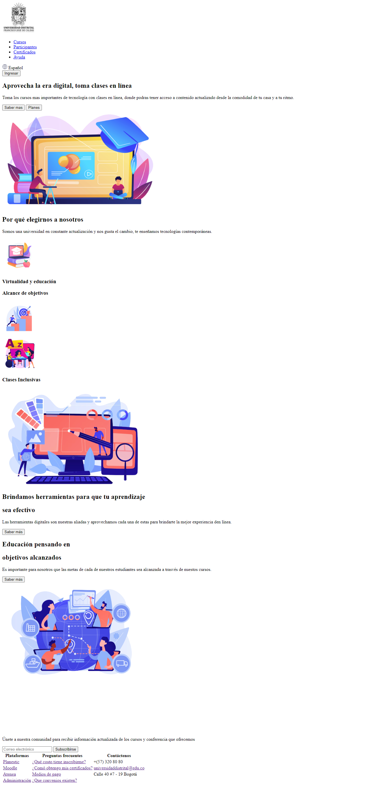

<h1>Taller 9 Diana Carolina Hernandez Sogamoso</h1>

<h2> Información</h2>

Curso: full Stack Basico - Grupo 1

Profesor: Cristian Patiño

<h2> Punto 1: Link figma</h2>

<a href="https://www.figma.com/file/5IG5PIgM1WfeArBzwKT1cl/Diana-Carolina-Hernandez-Sogamoso?type=design&node-id=5%3A256&mode=design&t=TY7Qm1CEtwRkurDN-1" target="_blank">Link de Figma</a>

<h2>Punto 2: HTML</h2>
